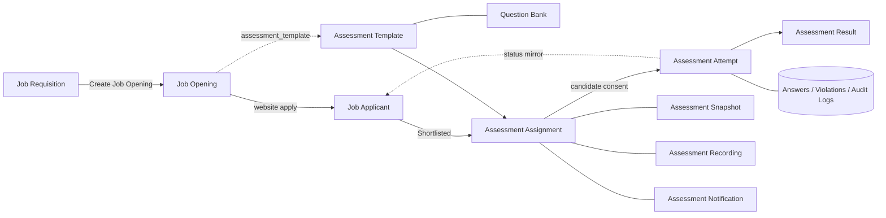
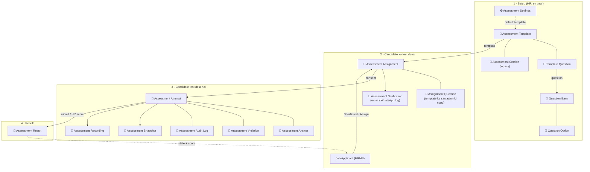

# Recruitment System — Andar se poori samajh (recruitment2)

Site: `ampugerp.in` · Last verified: 2026-10-06 (grid_erp merge ke baad)
Process steps (kaun kya kab kare) ke liye [recruitment.md](recruitment.md) dekho.
(Yeh file pehle `recruitment2.md` naam se app ke root mein thi.)
Yeh document batata hai **kya kahan rehta hai, kaunsa document kya karta hai, har document
mein kya bhara hota hai, aur system andar se kaise chalta hai.**

---

## 0. Code kahan hai — ek app, teen modules

Pehle do custom apps the (`grid_erp` aur `akash_recruitment_assessment`). **2026-10-06 se sirf ek
app hai: `grid_erp`.** Recruitment Assessment ab uska ek module hai. Logic aur code wahi hai,
sirf folder aur import path badle (`akash_recruitment_assessment.…` → `grid_erp.…`).

```
grid_erp/                                  repo root (~/frappe_docker/custom_apps/grid_erp)
├── README.md                              teeno modules ki table + poora file tree
├── docs/
│   ├── whatsapp.md                        WhatsApp guide
│   ├── recruitment.md                     process: kaun kya kab kare
│   └── recruitment-internals.md           yeh file: andar se kaise chalta hai
└── grid_erp/                              Python package (asli app)
    ├── hooks.py                           saare hooks, har module ka alag section
    ├── modules.txt                        Grid ERP · Grid WhatsApp · Recruitment Assessment
    ├── desktop.py                         Business Suite desktop folder
    ├── workspace_sidebar/                 4 sidebars: grid, whatsapp,
    │                                      recruitment_assessment, assessment_result
    ├── grid_erp/                          module "Grid ERP"       → branding
    ├── grid_whatsapp/                     module "Grid WhatsApp"  → WhatsApp
    ├── recruitment_assessment/            module "Recruitment Assessment" ↓
    │   ├── doctype/                       16 DocTypes (section 2.1)
    │   ├── report/                        6 reports
    │   ├── workspace/                     "Recruitment Assessment" workspace page
    │   ├── workflow.py                    kaunsa template + Shortlist par auto-send
    │   ├── service.py                     assignment, login, start, autosave, submit, scoring
    │   ├── api.py                         portal + HR ke whitelisted APIs
    │   ├── notifications.py               invite email (turant jaata hai)
    │   ├── install.py · seed.py           custom fields, roles, starter templates
    │   └── scheduler.py · evaluation.py · ai_evaluation.py · certificate.py · audit.py …
    ├── patches/recruitment_assessment/    purane data patches (dobara nahi chalte)
    ├── fixtures/                          "Assessment Invitation" Email Template
    ├── www/assessment-portal/             candidate portal page (/assessment-portal)
    └── public/
        ├── js/recruitment_assessment/     desk scripts (job_applicant.js, assessment_*.js …)
        │                                  + proctoring.js (candidate portal)
        ├── css/recruitment_assessment/    proctoring.css
        └── icons/desktop_icons/           Business Suite icons
```

**Flow — code mein ek candidate kaise chalta hai:**

```
Job Applicant → Shortlisted (Save)
   │  hooks.py: doc_events["Job Applicant"]
   ▼
workflow.sync_job_applicant_assessment
   │  Assessment Settings > Auto-send on Shortlist ON?  (ya Job Opening par Auto-assign ON)
   │  template = Job Opening ka → warna Settings ka default
   ▼
service.create_assignment  ──►  notifications.send_assessment_email (now=True, turant)
   ▼
Candidate: www/assessment-portal + public/js/recruitment_assessment/proctoring.js
   │  api.py (login, consent, start, autosave, upload, submit)
   ▼
Assessment Attempt (answers + ek video: camera + audio) → Assessment Result
   ▼
HR: Assessment Attempt form (public/js/recruitment_assessment/assessment_attempt.js)
   → Save Score → Job Applicant ka Assessment tab update
```

---

## 1. Desktop par kahan milega — "Business Suite"

Sab kuch ek hi custom app **grid_erp** mein hai (Recruitment Assessment pehle alag app
`akash_recruitment_assessment` tha, ab grid_erp ka module hai). Desktop par ek hi folder:

```
Business Suite
│
├── Communication
│    └── WhatsApp                  (grid_erp · module Grid WhatsApp)
│
├── Hiring
│    ├── Recruitment Assessment    (grid_erp · module Recruitment Assessment)
│    └── Assessment Result         (grid_erp · module Recruitment Assessment)
│
└── Grid                           (grid_erp · module Grid ERP)
```

> Folder ka naam **Hiring** hai, "Recruitment" nahi — Frappe mein desktop icon ka naam unique
> hota hai aur "Recruitment" HRMS ka apna icon pehle se use karta hai.
> WhatsApp ke notification rules WhatsApp ke andar hi hain, isliye alag Automation folder nahi hai.

### Har icon kholne par kya milta hai

| Icon | Sidebar mein kya hai | Kaun dekh sakta hai |
|------|----------------------|---------------------|
| **WhatsApp** | Message Log · Setup: WhatsApp Settings, Instances, Templates · Automation: Notification Rules | System Manager, WhatsApp Manager |
| **Recruitment Assessment** — test banana aur chalana | Home · **Setup:** Assessment Template, Question Bank · **Assessments:** Assignment, Attempt, Notification · **Reports:** Pending, Expired · **Settings:** Assessment Settings | HR Manager, HR User, Recruiter, System Manager |
| **Assessment Result** — test ke baad dekhna | Results · **Reports:** Completed, Candidate Leaderboard, Template Analytics, Violation Reports · **Proctoring:** Snapshots, Recordings | HR / Interviewer / Recruiter (read) |
| **Grid** | Branding Settings (logo, colours, login page) | Sirf Administrator |

Jis user ko kisi folder ke andar kuch bhi allowed nahi, use woh folder dikhega hi nahi
(jaise **Grid** sirf Administrator ko dikhta hai).

**Sidebar ke niyam (taaki aage confusion na ho):**
- Sidebars mein **sirf humare custom doctypes / reports** hain. HRMS ke Job Requisition, Job Opening,
  Job Applicant, Interview, Job Offer HRMS ke apne **Recruitment** workspace mein hi milenge.
- Ek cheez **sirf ek icon** mein hai — dono icons mein kuch common nahi.
- **Child tables** (section 2.1 mein 🔸 wale) sidebar mein nahi daale jaate — unki apni list nahi
  hoti, woh hamesha apne parent form ke andar khulti hain. Aaj saare 9 non-child doctypes
  (8 normal + 1 single) sidebar mein hain, kuch baaki nahi.
- **Assessment Result ka koi workspace page nahi hai** (WhatsApp ki tarah). Workspace ka naam
  DocType jaisa ho to `/desk/assessment-result` workspace khol deta tha aur result ki list kabhi
  nahi khulti thi — isliye woh page hata diya.

### Yeh kaise bana hai (technical)

| Cheez | File |
|-------|------|
| Folder / icon tree (har migrate par khud banta / theek hota hai) | `grid_erp/grid_erp/desktop.py` → `sync_business_suite` (`after_migrate`) |
| 3 level nesting (Suite → folder → icon) | `desktop.py` → `add_nested_desktop_icons` (`boot_session`). Frappe khud sirf 2 level rakhta hai. |
| Sidebars (WhatsApp, Grid, Recruitment Assessment, Assessment Result) | `grid_erp/grid_erp/workspace_sidebar/*.json` (JSON badlo to `modified` bhi aage badhao, warna migrate import nahi karega) |
| Icon artwork (54×54 SVG, `solid` + `subtle`) | `grid_erp/public/icons/desktop_icons/{solid,subtle}/<label>.svg` |
| Communication / Hiring folder par apna logo (andar ke icons ka thumbnail nahi) | `grid_erp/public/js/calco_branding.js` → `applyFolderLogos`; list `calco_workspace_config.js` → `folderLogoLabels` |

Naya icon jodna ho: `desktop.py` ki `SUITE_ICONS` mein ek line + usi naam ka Workspace Sidebar +
SVG → `bench migrate`. Purane app ka "Akash Recruitment Assessment" top-level icon migrate par
delete ho jaata hai (sab kuch ab Business Suite > Hiring mein hai).

---

## 2. Bada picture — kaunse documents, kaise jude hain



**Ek line mein:** HRMS ke 3 documents (Requisition → Opening → Applicant) hiring sambhalte hain.
Applicant shortlist hote hi hamara app ek **Assignment** banata hai (test ka "ticket").
Candidate test shuru karta hai to **Attempt** banta hai (asli answer sheet). Submit hone par
**Result** banta hai. Sab ka status wapas Job Applicant ke **Assessment tab** mein dikhta hai.

### 2.1 Saare 16 DocTypes — kaunsi child table kis document ke andar hai

Module **Recruitment Assessment** mein 16 DocTypes hain:
- 📄 **8 normal documents** — apni list hoti hai, sidebar mein hain
- ⚙️ **1 single** — Assessment Settings (ek hi record, poore module ki settings)
- 🔸 **7 child tables** — apni list nahi hoti, sirf parent form ke andar table ki tarah dikhti hain

#### Kaunsa document, uske andar kaunsi child table

```
📄 Question Bank                         ── ek sawaal
   └─🔸 Question Option                   (options)      MCQ ke options: text, correct?, image

📄 Assessment Template                   ── test ka design (submittable)
   ├─🔸 Assessment Template Question      (questions)    kaunse sawaal → Question Bank
   └─🔸 Assessment Section                (sections)     purane "Legacy Sections" → Question Bank

📄 Assessment Assignment                 ── candidate ka test ticket
   └─🔸 Assessment Assignment Question    (questions)    template ke sawaalon ki is candidate ke
                                                         liye fixed copy → Question Bank

📄 Assessment Attempt                    ── candidate ki asli answer sheet
   ├─🔸 Assessment Answer                 (answers)      har sawaal ka jawab + score → Question Bank
   ├─🔸 Assessment Violation              (violations)   tab switch, fullscreen exit, copy/paste…
   └─🔸 Assessment Audit Log              (audit_logs)   har ghatna: consent, start, upload, submit…

📄 Assessment Result                     ── final marksheet          (koi child table nahi)
📄 Assessment Snapshot                   ── webcam photo             (koi child table nahi)
📄 Assessment Recording                  ── screen/camera recording  (koi child table nahi)
📄 Assessment Notification               ── kaunsi email/WhatsApp gayi (koi child table nahi)
⚙️ Assessment Settings                   ── module settings          (koi child table nahi)
```

| Child table 🔸 | Parent document | Parent mein field | Ek row = |
|----------------|-----------------|-------------------|----------|
| Question Option | Question Bank | `options` | Ek MCQ option |
| Assessment Template Question | Assessment Template | `questions` | Template ka ek sawaal |
| Assessment Section | Assessment Template | `sections` | Ek purana section (legacy) |
| Assessment Assignment Question | Assessment Assignment | `questions` | Candidate ko mila ek sawaal |
| Assessment Answer | Assessment Attempt | `answers` | Ek sawaal ka jawab |
| Assessment Violation | Assessment Attempt | `violations` | Ek proctoring violation |
| Assessment Audit Log | Assessment Attempt | `audit_logs` | Ek ghatna (event) |

> **Violations kahan dekhein?** Assessment Violation child table hai — iski list nahi khulti.
> Saare candidates ki violations ek saath **Violation Reports** report mein dikhti hain
> (Assessment Result sidebar), ya ek candidate ki uske **Attempt** form ke *Violations* table mein.

#### Flow — ek sawaal se final result tak



**Seedhi bhasha mein:**
1. **Setup:** HR *Question Bank* mein sawaal banata hai (MCQ ke options uski *Question Option*
   table mein). Phir *Assessment Template* banata hai aur uski *Questions* table mein sawaal chunta hai.
2. **Assign:** Applicant shortlist hua to *Assessment Assignment* banta hai. Template ke sawaal
   uski *Questions* table mein **copy** ho jaate hain — baad mein template badle to bhi is
   candidate ka test nahi badalta. Email / WhatsApp gayi to *Assessment Notification* banta hai.
3. **Test:** Candidate consent deta hai to *Assessment Attempt* banta hai. Har jawab →
   *Answers* table, har gadbad → *Violations* table, har ghatna → *Audit Logs* table.
   Webcam photos alag *Assessment Snapshot* documents, recordings alag *Assessment Recording*.
4. **Result:** Submit par *Assessment Result* banta hai (HR manual score de to update hota hai),
   aur state + score wapas Job Applicant ke Assessment tab mein.

---

## 3. HRMS documents (aur unme humne kya joda)

### 3.1 Job Requisition — "humein ek banda chahiye"
- **Kaun banata hai:** HOD / Manager. **Naam:** `HR-HIREQ-#####`
- **Kya hota hai:** Designation, Department, No. of Positions, Expected Compensation,
  Requested By (Employee), Posting Date, Expected By, Description, Reason for Requesting,
  Status (*Pending → Open & Approved → Filled / Rejected / On Hold / Cancelled*).
- **Humara joda hua (Job Description tab > Assessment):**
  - **Assessment Template** — is position ke candidates ka test
  - **Auto-assign on Shortlist** (default ON)
- **Aage kya:** *Open & Approved* par **Create Job Opening** button. Upar ke dono fields opening
  mein apne aap copy hote hain. Opening *Closed* hone par requisition *Filled* ho jaati hai.

### 3.2 Job Opening — "vacancy jo website par dikhti hai"
- **Naam:** `HR-OPN-YYYY-####`
- **Kya hota hai:** Job Title, Designation, Department, Company, Status (Open/Closed),
  Posted On, Closes On, Vacancies, salary range, Description, **Publish on website**, route,
  Job Requisition (link).
- **Humara joda hua:** **Assessment Template** + **Auto-assign on Shortlist**.
  Yahi final hai — applicant ko yahi test jayega. Khaali ho to Assessment Settings ka default.
- **Website:** publish ON ho to `/jobs` par dikhti hai, Apply button `/job_application/new`.

### 3.3 Job Applicant — "ek candidate ki application"
- **Naam:** candidate ka email (jaise `akashsharma730096@gmail.com`)
- **Kya hota hai:** Applicant Name, Email, Phone, Job Opening, Designation, Source,
  Resume (attachment / link), Cover Letter, Status (*Open, Replied, Shortlisted, Rejected,
  Hold, Accepted*).
- **Humara joda hua — "Assessment" tab (sab read-only, system bharta hai):**

| Field | Kya dikhata hai |
|-------|-----------------|
| Assessment State | Not Assigned / Assigned / Pending / Started / Submitted / Passed / Failed / Expired |
| Assessment Assignment | Assignment ka link |
| Assessment Summary | Kaunsa test, link, status (HTML card) |
| Assigned On / Assigned By | Kab, kisne |
| Assessment Link | Candidate ka portal link |
| Assessment Status / Attempt Status | Portal aur attempt ki halat |
| Score | % |
| Email Sent | Invite gaya ya nahi |
| Violation Count | Proctoring violations |
| Recording | Screen/camera recording file |
| Snapshots | (display only) |

- **Buttons (Assessment menu):** **Assign Assessment** (koi bhi template chuno — hamesha dikhta
  hai; assignment pehle se ho to naam **Assign Another Assessment**), View Assessment,
  View Attempt, View Recording, Send Reminder, Send <template> (shortlisted + assignment nahi).
- **List view:** *Bulk Assign Assessment* action, aur list mein assessment state ka rang.
- **Pehle galat tha:** applicant par khud "Assessment Template" field tha. Woh hata diya —
  candidate ko pata hi nahi hota, yeh HR ka decision hai.

### 3.4 Interview / Job Offer
HRMS standard. Assessment pass hone ke baad HR inhe normal tarike se banata hai
(HRMS ke **Recruitment** workspace se — humare sidebars mein HRMS ke doctypes nahi hain).

---

## 4. Assessment documents — har ek mein kya hai

### 4.1 Question Bank — "ek sawaal"
- **Naam:** `AST-QTN-YYYY-#####` · **Kaun:** HR / Recruiter
- **Fields:** Question Title, Disabled, **Question Type**, Category, Difficulty
  (Easy/Medium/Hard), Marks, Negative Marking, Question Text, **Options** (table:
  Option Text, Correct, Option Image), Correct Answer, Coding Language, SQL Schema,
  Expected Output, Attachment.
- **Question Types:**

| Type | Candidate kya karta hai | Check kaise hota hai |
|------|------------------------|----------------------|
| Single Choice MCQ / Multiple Choice / True/False | Option chunta hai | **Auto** |
| Short Answer / Long Answer / Coding / SQL | Likhta hai | HR manually ya **AI Evaluate** |
| **Video Response** | Browser mein video record karta hai | **HR video dekh ke** |
| File Upload / Image-based | File upload karta hai | HR manually |

- **Abhi:** 30 GK MCQs + 1 Video Response ("Video Introduction - Tell us about yourself", 10 marks).

### 4.2 Assessment Template — "test ka design"
- **Naam:** `AST-TPL-YYYY-#####` · **Kaun:** HR
- **Fields:** Template Name, Description (candidate ko email mein dikhta hai), Active,
  **Default Duration (min), Default Validity (days), Passing Percentage**, Total Questions /
  Total Marks / Question Categories (auto), Negative Marking, Randomize Questions,
  Shuffle Options, Maximum Attempts, Allow Resume, **Evaluation Rule**
  (Auto Only / Auto + Manual / Manual Only), **Questions** table (Question Bank links,
  marks/type auto-fill), filter + preview helpers, Legacy Sections.
- **Abhi ke templates:**

| Template | Questions | Duration | Pass | Evaluation |
|----------|-----------|----------|------|------------|
| General Video Introduction (`AST-TPL-2026-00002`) | 1 video | 15 min | 0% | Manual Only |
| Trial Basic GK Proctored Test (`AST-TPL-2026-00001`) | 30 MCQ | 30 min | 40% | Auto Only |

### 4.3 Assessment Assignment — "candidate ko diya gaya test ka ticket"
- **Naam:** `AST-ASSIGN-YYYY-#####` · **Kab banta hai:** Applicant *Shortlisted* (auto) ya
  HR ka *Assign Assessment* · **Ek applicant + ek template = ek assignment.**
- **Assignment Details:** Job Applicant, Applicant Name, Candidate Email/Phone, Job Opening,
  Designation, Department, Assessment Template, Assigned On/By, Email Template, Email Sent.
- **Access Tokens (sab encrypted / Password fields):**
  - **Assignment Token** — email link mein jaata hai, **sirf ek baar** chalta hai
    (*Token Used On* bhar jaata hai)
  - **Temporary Password** — backup login (email mein hota hai)
  - Hashes + **Portal Session** (login ke baad 12 ghante ka session)
- **Status:** Assessment State / Portal Status (Assigned → Pending → Started → Submitted →
  Passed/Failed, ya Expired), Current Attempt.
- **Questions** table — template ke sawaalon ki copy (is candidate ke liye fixed, random order).
- **Policy:** Validity Days, **Valid Till**, Duration, Passing Marks, Negative Marking,
  Max Attempts, Randomize/Shuffle, proctoring switches (Webcam Recording, Snapshots,
  Microphone, Screen Recording, Fullscreen, Tab Switch, Copy/Paste, Right Click, DevTools),
  Snapshot Interval, Grace Periods, Microphone Failure Behavior, Allow Resume, Auto Save,
  Auto Submit, Email / WhatsApp Notifications.

### 4.4 Assessment Attempt — "candidate ki asli answer sheet"
- **Naam:** `AST-ATT-YYYY-#####` · **Kab banta hai:** candidate portal par **consent** deta hai.
- **Attempt Details:** Assignment, Job Applicant, Template, Attempt No, **Status**
  (Consent Accepted → Started → Submitted → Evaluated), Started/Ends/Last Saved/Submitted On,
  Duration, Time Taken.
- **Consent & Privacy:** Consent Accepted + time, IP, Browser, OS, User Agent,
  **Audit Logs** table (har ghatna: consent, permissions, start, recording, upload, submit…).
- **Proctoring:** Screen Recording File, **Video Recording (Camera + Audio)** — camera ki video
  aur mic ki awaaz **ek hi file** mein, Microphone Recording File (sirf purane attempts / bina
  camera ke, khaali ho to chhupa rehta hai), Recording / Camera / Mic /
  Screen / Fullscreen Status, **Violation Count**, Last Heartbeat (har 15 sec),
  Resume Allowed, Pause Reason, **Violations** table (Window lost focus, Tab switched,
  Fullscreen exited, Copy/Paste, DevTools… with severity + time + IP).
- **Answers** table — har sawaal ki ek row: Question, Type, **Answer**, **Response File**
  (video / upload), Score, Marks, Evaluation Status (Pending Review / Auto Evaluated /
  Evaluated / AI Evaluated), Correct, Remarks, AI Feedback.
- **Result Details:** Total Score, Maximum Score, Percentage, Passing Marks,
  **Result Status** (Pending Review / Passed / Failed).
- **Form par (HR):** **Answers to Review** panel (video player + Score + Remarks + Save Score),
  proctoring recordings player, *AI Evaluate Open Answers*, *Open Result*.

### 4.5 Assessment Result — "final marksheet"
- **Naam:** `AST-RSLT-YYYY-#####` · **Kab:** submit par banta hai, HR score par update hota hai.
- **Fields:** Assignment, Attempt, Job Applicant, Template, Total / Maximum Score,
  Percentage, **Result** (Pending Review / Passed / Failed), **Manual Pending** (kitne answers
  abhi score hone baaki), Time Taken, Evaluated By/On, Remarks.

### 4.6 Proctoring ke saath ke documents
| DocType | Naam | Kya rakhta hai |
|---------|------|----------------|
| Assessment Snapshot | `AST-SNAP-…` | Webcam photo (start, har ~60 sec, har violation par, submit se pehle) + reason, IP |
| Assessment Recording | `AST-RCD-…` | Session ki Screen recording aur Camera recording (video + audio ek file), type, duration |
| Assessment Notification | `AST-NOT-…` | Kaunsi email / WhatsApp bheji, kab (password log nahi hota) |

### 4.7 Assessment Settings (single) — "poore module ki settings"
| Section | Fields |
|---------|--------|
| Assessment Defaults | **Default Assessment Template** (abhi: General Video Introduction), **Auto-send Assessment on Shortlist** (abhi ON — sab Shortlisted applicants ko apne aap), **Portal Base URL** (abhi `http://localhost:8080`) |
| AI Evaluation | OpenAI API Key, AI Model |
| Certificate | Company Name, Logo, Footer Text |
| WhatsApp (legacy) | Provider, API URL, Key, Template Name |

---

## 5. Ek candidate ki journey — kaunse document kab bante hain

| # | Kya hua | Kaunsa document bana / badla | Job Applicant > Assessment State |
|---|---------|------------------------------|----------------------------------|
| 1 | HR ne requisition approve karke opening banayi | Job Requisition, Job Opening | — |
| 2 | Candidate ne `/jobs` se apply kiya | **Job Applicant** (Open) | Not Assigned |
| 3 | HR ne *Shortlisted* kiya | **Assessment Assignment** + email turant + Assessment Notification | Assigned |
| 4 | Candidate ne link khola + consent diya | Assignment (session, token used) + **Assessment Attempt** | Pending |
| 5 | System check + Start | Attempt (Started) + Audit Logs + Snapshots | Started |
| 6 | Video record karke save | Attempt > Answers row (Response File) + File (private) + Audit Log | Started |
| 7 | Submit | Attempt (Submitted) + **Assessment Result** (Pending Review) + Assessment Recording(s) | Submitted |
| 8 | HR ne video dekh ke score diya | Attempt (Evaluated) + Result (Passed/Failed) + Assignment | **Passed / Failed** |

---

## 6. Andar se kaise chalta hai (technical)

### 6.1 Kaunsa test milega — template resolution
`workflow.get_job_applicant_assessment_template`:
1. Applicant ka assignment pehle se hai → wahi template
2. Warna **Job Opening** ka Assessment Template
3. Warna **Assessment Settings > Default Assessment Template**

### 6.2 Auto-assign
`hooks.py` → Job Applicant `after_insert` / `on_update` → `workflow.sync_job_applicant_assessment`
→ agar status *Shortlisted* **aur** auto-send ON **aur** assignment nahi hai →
`service.create_assignment` (template ki duration/validity/passing) → email **turant**
(`frappe.sendmail(now=True)`, Email Queue mein ruka nahi rehta).

Auto-send ON kab maana jaata hai (`workflow.is_auto_assign_enabled`):
1. **Assessment Settings > Auto-send Assessment on Shortlist** ON → sab applicants (abhi yahi ON hai)
2. Warna Job Opening par **Auto-assign on Shortlist** ON → sirf us opening ke applicants

Auto-send fail ho (jaise template inactive) to applicant phir bhi save hota hai, orange message
aata hai aur Error Log mein "Auto assessment on Shortlist failed". **Manual:** Job Applicant >
Assessment > **Assign Assessment / Assign Another Assessment** → koi bhi template. Ek applicant ko
same template do baar nahi jaata.

### 6.3 Candidate portal
- Page: `www/assessment-portal/` · JS: `public/js/recruitment_assessment/proctoring.js` · CSS: `public/css/recruitment_assessment/proctoring.css`
- Login: link ka token (ek baar) **ya** Assignment ID + email + Temporary Password →
  12 ghante ka session token (`X-Assessment-Token` header). Desk cookies nahi bheje jaate
  (`credentials: "omit"`), isliye HR ka login same browser mein ho to bhi chalega.
- Screens: Login → Welcome → Consent → System Check (camera, mic, screen, browser, internet,
  fullscreen) → Test → Result message.
- Test ke dauraan: autosave har 15 sec, heartbeat har 15 sec, snapshots, violations,
  session recordings (screen alag; **camera + mic ek hi video file** mein). **Video answer:** camera+mic se record (10 sec – 3 min, ~700 kbps),
  upload → `api.upload_answer_file` → answer row ki *Response File*. Fail ho to 3 retry.
- Submit: pending video/recordings upload hone ka wait → `complete_attempt` → evaluate →
  Result. Candidate ko score sirf tab dikhta hai jab koi manual review baaki na ho.

### 6.4 Scoring
- MCQ / True-False: `evaluation.evaluate_answer` (auto).
- Video / written / file: *Pending Review* → HR **Save Score** → `service.record_manual_score`
  → totals, %, Result, Assignment status, Job Applicant sab update.
- AI (optional): written answers ke liye OpenAI; video aur files skip.

### 6.5 Data safety
- Tokens/passwords: Password fields (encrypted in `__Auth`), padhne ke liye
  `AssessmentAssignment.get_secret()`.
- Videos, recordings, snapshots: **private files** (sirf permission wale HR users).
- Ek attempt par parallel requests: hot paths sirf apni row update karte hain +
  `utils.retry_on_conflict` (MariaDB write conflict par retry).

### 6.6 Code map
Saare paths `grid_erp/grid_erp/` ke andar hain.

| File | Kaam |
|------|------|
| `hooks.py` (section "Recruitment Assessment" + doc_events / scheduler / install upar) | doc_events, scheduler, after_migrate, form scripts, portal route |
| `recruitment_assessment/install.py` | Custom fields (Job Applicant / Opening / Requisition), roles, seed |
| `recruitment_assessment/seed.py` | Email template, GK test, General Video Introduction |
| `recruitment_assessment/workflow.py` | Template resolution, auto-assign, applicant summary |
| `recruitment_assessment/service.py` | Assignment, login, consent, start, autosave, submit, scoring |
| `recruitment_assessment/api.py` | Whitelisted APIs (portal + HR) |
| `recruitment_assessment/notifications.py` | Invite email |
| `recruitment_assessment/audit.py` | Audit log, violations, notification log |
| `recruitment_assessment/evaluation.py` / `ai_evaluation.py` | Auto / AI scoring |
| `recruitment_assessment/scheduler.py` | Reminders, expiry, result recompute |
| `recruitment_assessment/cleanup.py` | "Delete with Attempts" — assignment + saara data safe order mein |
| `public/js/recruitment_assessment/job_applicant*.js`, `assessment_*.js` | Desk buttons, dialogs, HR review panel |
| `public/js/recruitment_assessment/proctoring.js` + `www/assessment-portal/` | Candidate portal, recordings |
| `patches/recruitment_assessment/` | Purane one-time patches |

### 6.7 Roles
| DocType | HR Manager | HR User | Recruiter | Interviewer |
|---------|-----------|---------|-----------|-------------|
| Template, Question Bank, Assignment, Snapshot | ✏️ | ✏️ | ✏️ | — |
| Attempt | ✏️ | ✏️ | ✏️ | 👁 |
| Result | ✏️ | ✏️ | 👁 | 👁 |
| Recording, Notification | ✏️ | ✏️ | — | — |
| Assessment Settings | ✏️ | — | — | — |

(System Manager ko sab.) Candidate ka ERP mein koi user nahi hota — woh sirf portal token se aata hai.

---

## 7. Scheduler (background)
| Kab | Kya |
|-----|-----|
| Turant | Assessment invite email (`now=True`) |
| Har ~4 min | Baaki Email Queue bhejna (Frappe) + due assessment notifications |
| Hourly | Reminders, expired assignments → *Expired* |
| Daily | Results recompute |

---

## 8. Jaldi jawab (FAQ)

- **Candidate ko kaunsa test jayega, kahan badlun?** Job Opening > Assessment Template
  (ya Requisition par, opening banane se pehle).
- **Shortlist kiya par email nahi gaya?** Assessment Settings > *Auto-send Assessment on
  Shortlist* OFF hai (aur opening par Auto-assign bhi OFF), ya Error Log / Email Queue dekho.
  Manual: Job Applicant > Assessment > Assign Assessment.
- **Koi aur test bhi bhejna hai?** Job Applicant > Assessment > **Assign Another Assessment** →
  template chuno.
- **Video mein awaaz nahi?** Naye attempts mein camera video ke andar hi awaaz hai
  ("Video Recording (Camera + Audio)"). Purane attempts mein awaaz alag Microphone file mein hai.
- **Candidate ka video kahan dekhun?** Job Applicant > Assessment > View Attempt >
  *Answers to Review*.
- **Dobara test dena hai?** Behtar: **Assign Another Assessment** (purana record rehta hai).
  Same template hi dobara chahiye to purana Assignment > Actions > **Delete with Attempts**.
- **Assignment delete nahi ho raha ("linked with Assessment Attempt")?** Assignment aur Attempt
  ek doosre se jude hain (`assignment` ↔ `current_attempt`), isliye normal Delete kabhi nahi
  chalega. **Delete with Attempts** (`recruitment_assessment/cleanup.py`, sirf HR Manager /
  System Manager): pehle dikhata hai kya-kya jayega; Result, Snapshot, Recording, Notification →
  Attempt (answers, violations, audit log) → Assignment, sab ek transaction mein; video files
  disk se commit ke baad background job hatata hai; Job Applicant wapas *Not Assigned* (ya
  agla assignment) + ek comment. Passed/Failed result ho to laal warning — asli candidate ka
  record sirf galti / test data ho tabhi hatao.
- **Naya test banana hai?** Question Bank mein sawaal → Assessment Template → Active.
- **Desktop par icon nahi dikh raha?** Page reload karo; user ke paas us sidebar ke
  DocType ki permission honi chahiye. Agar user ne desktop layout customise kiya hai to
  desktop menu se *Reset* karo.
