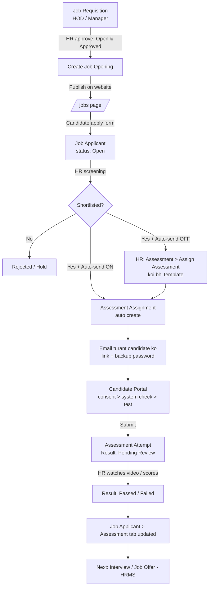

# Recruitment Flow — Job Requisition se Assessment tak

Site: `ampugerp.in` (ERPNext v16 + HRMS + `grid_erp`, module **Recruitment Assessment**)
Last verified end-to-end: 2026-10-06 · Andar ki detail + code tree: [recruitment-internals.md](recruitment-internals.md)

Yeh document batata hai ki ek position ki demand se lekar candidate ke assessment result tak
system kaise kaam karta hai, kaun kya karta hai, aur kuch atke toh kahan dekhna hai.

---

## 1. Poora flow ek nazar mein



| # | Step | Kaun karta hai | Kahan |
|---|------|----------------|-------|
| 1 | Position ki demand | HOD / Manager | HR > Job Requisition |
| 2 | Approve + assessment choose | HR | Job Requisition |
| 3 | Job Opening banana + publish | HR | Requisition > **Create Job Opening** |
| 4 | Apply karna | Candidate | Website `/jobs` |
| 5 | Screening + Shortlist | HR | Job Applicant |
| 6 | Assessment link bhejna | System (Shortlist par auto) ya HR (koi bhi template) | Job Applicant > **Assessment** button |
| 7 | Assessment dena | Candidate | Email ka link → Assessment Portal |
| 8 | Video dekhna + score dena | HR | Assessment Attempt > **Answers to Review** |
| 9 | Result dekhna | HR | Job Applicant > **Assessment** tab |
| 10 | Interview / Offer | HR | HRMS (Interview, Job Offer) |

---

## 2. One-time setup (sirf ek baar)

### 2.1 Email Account
**Setup > Email Account** mein outgoing account hona zaroori hai, warna candidate ko link nahi jayega.

- Abhi: **Ampug Solutions** (`gridcellsolutions@gmail.com`), Gmail SMTP, *Default Outgoing* ON.
- Gmail ke liye App Password use hota hai (normal password nahi).
- Assessment invite email **turant** jaata hai (Email Queue mein ruka nahi rehta).
  Baaki emails Email Queue se scheduler har ~4 minute mein bhejta hai.

### 2.2 Assessment Settings
**Recruitment Assessment > Assessment Settings**

| Field | Kya karta hai | Abhi value |
|-------|---------------|------------|
| Default Assessment Template | Jab Requisition/Opening par template na ho, yeh use hota hai | General Video Introduction |
| Auto-send Assessment on Shortlist | ON = **har** applicant ko Shortlisted karte hi assessment email apne aap | ON |
| Portal Base URL | Email ke link ka address | `http://localhost:8080` (sirf testing) |

> **Zaroori:** Browser camera/mic sirf **HTTPS** (ya `localhost`) par deta hai.
> Bahar ke candidates ke liye site ko public HTTPS domain par chalana hoga
> (jaise `https://careers.ampug.in`) aur wahi yahan Portal Base URL mein daalna hoga.
> `http://` domain par video record nahi hoga.

### 2.3 Assessment Templates
**Recruitment Assessment > Assessment Template**

| Template | Kya hai | Duration | Scoring |
|----------|---------|----------|---------|
| **General Video Introduction** | Candidate 1–3 min ka video intro record karta hai | 15 min | HR manually (video dekh ke) |
| Trial Basic GK Proctored Test | 30 MCQ (GK, reasoning, English…) | 30 min | Auto |

Naya template: Question Bank mein questions banao → Template mein add karo → *Is Active* ON.
Template ki **Default Duration / Validity Days / Passing Marks** hi auto-assign mein use hoti hain.

---

## 3. Step-by-step process

### Step 1 — Job Requisition (HOD / Manager)
**HR > Recruitment > Job Requisition > New**

- Designation, No. of Positions, Expected Compensation, Requested By, Description bharo.
- **Job Description tab > Assessment section:**
  - **Assessment Template** — is position ke candidates ko kaunsa test dena hai.
    Khaali chhodo toh default (General Video Introduction) lagega.
  - **Auto-assign on Shortlist** — ON (default) ho toh Shortlist karte hi link apne aap jayega.
    (Assessment Settings mein *Auto-send Assessment on Shortlist* ON hai to yeh sab openings par
    already ON maana jaata hai.)

### Step 2 — Approve (HR)
Status **Open & Approved** karo. Tabhi **Create Job Opening** button aata hai.

### Step 3 — Job Opening (HR)
Requisition par **Create Job Opening** dabao. Designation, department, vacancies, salary,
description **aur Assessment Template + Auto-assign** apne aap copy ho jaate hain.

- Job Title theek karo (jaise "Sales Executive – Mumbai").
- **Publish on website** ON karo taaki `/jobs` par dikhe.
- Assessment Template yahan bhi badal sakte ho — Opening wala template final hota hai.

> Bina Requisition ke bhi Job Opening seedha bana sakte ho — bas Assessment Template /
> Auto-assign wahan set kar dena.

### Step 4 — Candidate apply karta hai
Candidate `http://<site>/jobs` → job kholta hai → **Apply** → naam, email, phone, resume.
Isse **Job Applicant** banta hai, status **Open**.

> Candidate ko yahan koi assessment choose nahi karna padta — woh HR/Opening decide karta hai.
> (Pehle Job Applicant par "Assessment Template" field tha, jo galat tha — hata diya gaya hai.)

### Step 5 — Screening + Shortlist (HR)
Job Applicant kholo, resume dekho, status **Shortlisted** karo aur Save.

- **Auto-send ON (abhi yahi hai):** Save karte hi Assessment Assignment banta hai aur email
  **turant** chala jaata hai. Upar green message aata hai "Assessment link emailed to …".
- **Manual (kabhi bhi, koi bhi template):** **Assessment > Assign Assessment** dabao → template,
  expiry, duration, proctoring options choose karo → *Assign & Send Email*.
  Ek assessment pehle se gaya ho to button **Assign Another Assessment** dikhega — doosra
  template bhi bhej sakte ho (same template dobara nahi jaata).
- Auto-send OFF karna ho: Assessment Settings > *Auto-send Assessment on Shortlist* untick.
  Tab sirf un Job Openings par auto jayega jahan *Auto-assign on Shortlist* ON hai.
- **Bahut saare candidates:** Job Applicant list mein select karo → Actions >
  **Bulk Assign Assessment**.

Job Applicant ke **Assessment tab** mein: State, Assignment, link, score, violations dikhte hain
(sab read-only, system bharta hai).

### Step 6 — Candidate ko email
Subject: **Online Assessment: <Template Name>**. Email mein:
- **Open Secure Assessment** button (link sirf **ek baar** chalta hai)
- Backup login: Assignment ID, Candidate ID (email), Temporary Password
- Expiry date (default 3 din)

### Step 7 — Candidate Portal (candidate)
1. Link kholo (Chrome / Edge, laptop with webcam).
2. Welcome → **Consent** (monitoring policy tick karo) → **I Agree & Continue**.
3. **Check System** → camera, mic, screen share allow karo
   (screen share mein "Entire screen" choose karo) → **Start Assessment**.
4. Video question par: **● Start Recording** → bolo (10 sec – 3 min) → **■ Stop Recording**
   → "✓ Video saved" ka wait → chaho toh playback / **Record Again**.
5. **Submit** → "Our HR team will review…" message.

Test ke dauraan: screen recording + **ek video jismein camera aur awaaz dono** (alag mic file nahi), har minute snapshot, tab switch / fullscreen exit /
copy-paste jaise **violations** log hote hain. Timer khatam hone par auto-submit.

### Step 8 — HR review
**Assessment Attempt** kholo (Job Applicant > Assessment > View Attempt).

- **Answers to Review** panel: video chalao → Score (0 – max marks) + Remarks → **Save Score**.
- Score save hote hi total, %, Pass/Fail, Assessment Result aur Job Applicant update.
- MCQ wale answers auto-check ho jaate hain; written answers ke liye
  **🤖 AI Evaluate Open Answers** (OpenAI key Assessment Settings mein chahiye; video skip hota hai).
- Proctoring recordings bhi isi form par playable hain: **Screen Recording** aur
  **Video Recording (Camera + Audio)**. Purane attempts mein mic ki alag file bhi dikhegi.

### Step 9 — Result
Job Applicant > **Assessment tab** mein final State (**Passed / Failed**) aur Score.
Reports: *Candidate Leaderboard, Completed / Pending / Expired Assessments, Template Analytics,
Violation Reports*.

### Step 10 — Aage
HRMS ka normal flow: **Interview** schedule → **Job Offer** → Employee.

---

## 4. Statuses

**Job Applicant (HRMS):** Open → Replied → **Shortlisted** → Accepted / Rejected / Hold
(sirf *Shortlisted* auto-send trigger karta hai)

**Assessment State (Job Applicant / Assignment):**

| State | Matlab |
|-------|--------|
| Not Assigned | Abhi assessment nahi bheja |
| Assigned | Link bheja, candidate ne khola nahi |
| Pending | Candidate ne login / consent kiya |
| Started | Test chal raha hai |
| Submitted | Submit ho gaya, HR review baaki |
| Passed / Failed | HR review ke baad final |
| Expired | Validity khatam, submit nahi kiya |

**Result (Attempt / Assessment Result):** Pending Review → Passed / Failed.
Jab tak koi video/written answer score nahi hua, result **Pending Review** hi rehta hai
(candidate ko bhi koi score nahi dikhaya jaata).

---

## 5. Data kahan rehta hai

| DocType | Kya hai |
|---------|---------|
| Job Requisition / Job Opening / Job Applicant | HRMS standard (+ assessment custom fields) |
| Assessment Template + Question Bank | Test ka design |
| Assessment Assignment | Ek candidate ko ek test — link, token, expiry, proctoring settings |
| Assessment Attempt | Candidate ka actual test — answers, video, recordings, violations, audit log |
| Assessment Result | Final score summary |
| Assessment Snapshot / Recording | Webcam snapshots, screen/camera recordings |
| Assessment Settings | Default template, Portal Base URL, AI, certificate, WhatsApp |

Videos aur recordings **private files** hain (sirf HR login se khulte hain).

---

## 6. Problem aaye toh

| Problem | Wajah / Fix |
|---------|-------------|
| Email nahi gaya | Email Account default outgoing ON? Assessment email turant jaata hai — **Email Queue** mein status/error dekho. |
| Link nahi khul raha | Assessment Settings > Portal Base URL sahi hai? Link ek hi baar chalta hai — dobara ke liye email ka Temporary Password use karo. |
| "Invalid access token or temporary password" | Token use ho chuka hai → portal par Assignment ID + email + Temporary Password se login. |
| Camera / mic nahi mil raha | Site HTTPS par nahi hai (ya localhost nahi). Browser permission check karo. |
| Video "could not be saved" | Internet check; portal 3 baar retry karta hai. Phir bhi fail ho toh "Record Again". |
| "Assessment is already assigned" | Is applicant + template ka assignment pehle se hai. Doosra template chuno (*Assign Another Assessment*), ya same dobara chahiye toh purana Assignment **Delete with Attempts** se hatao. |
| "Cannot delete … linked with Assessment Attempt" | Normal Delete nahi chalega (Assignment aur Attempt ek doosre se jude hain). Assignment > Actions > **Delete with Attempts** (sirf HR Manager / System Manager). Sirf galat / test data ke liye — asli candidate ka record mat hatao. |
| Shortlist kiya par link nahi gaya | Assessment Settings > **Auto-send Assessment on Shortlist** OFF hai (aur Job Opening par Auto-assign bhi OFF) → manual **Assign Assessment**. |

---

## 7. Technical notes (developers ke liye)

- Code: ek hi custom app **grid_erp**, module **Recruitment Assessment**
  (`~/frappe_docker/custom_apps/grid_erp/grid_erp/recruitment_assessment`). Pehle yeh alag app
  `akash_recruitment_assessment` tha — 2026-10-06 ko grid_erp mein merge hua, logic same.
  Poora file tree: [recruitment-internals.md › 0](recruitment-internals.md).

  ```
  grid_erp/grid_erp/
  ├── hooks.py                      har module ka alag section
  ├── recruitment_assessment/       doctypes, reports, workflow, service, api …
  ├── www/assessment-portal/        candidate portal
  ├── workspace_sidebar/            4 sidebars
  └── public/js|css/recruitment_assessment/
  ```
- Deploy: `pwd.yml` mein sirf `hrms` + `grid_erp` bind-mount, sab 6 containers mein same code.
  Python change ke baad backend/queue/scheduler restart; JS/CSS change ke baad
  `www/assessment-portal/index.html` mein `?v=` badhao. DocType JSON badla → `bench migrate`.
- Hooks: Job Applicant `after_insert` / `on_update` → `workflow.sync_job_applicant_assessment`
  (Shortlisted + auto-send ON → `service.create_assignment` → email `now=True`).
- Template resolution (`workflow.get_job_applicant_assessment_template`):
  existing assignment → Job Opening template → Assessment Settings default.
- Portal: `grid_erp/www/assessment-portal` + `grid_erp/public/js/recruitment_assessment/proctoring.js`. Candidate `X-Assessment-Token`
  header se pehchana jaata hai; requests `credentials: "omit"` bhejti hain (HR ka desk cookie
  same browser mein ho toh Frappe CSRF "Invalid Request" deta tha).
- Secrets (`assignment_token`, hashes, temp password) **Password** fields hain → DB mein `****`;
  hamesha `AssessmentAssignment.get_secret()` se padho.
- Ek Attempt par portal ke parallel requests aate hain → hot paths (autosave, heartbeat,
  violation, upload) poora doc save nahi karte, sirf rows update karte hain, aur
  `utils.retry_on_conflict` MariaDB write-conflict (1020) par retry karta hai.
- Upload limit: 25 MB per file (System Settings > Max File Size), nginx 50 MB.

### 2026-10-06 ko fix hua
- Job Applicant se editable Assessment Template hataya; Requisition/Opening/default se aata hai.
- Job Requisition par Assessment Template + Auto-assign (Opening mein copy hota hai).
- General Video Introduction template + portal video recorder + HR review panel.
- Candidate login hamesha fail (Password-field hash) — fixed.
- Portal 404 (www galat folder mein) — fixed.
- Consent crash (HTML field par db_set) — fixed.
- Video/recording upload 500 (DB write conflict, har second autosave) — fixed.
- "Auto Save" violation spam — fixed.
- "Invalid Request" on portal (desk cookie + CSRF) aur purana localStorage session — fixed.
- Email: template/opening ka naam, backup login, Portal Base URL; auto-assign template ki
  duration use karta hai; result "Pending Review" jab tak HR score na de.

### 2026-10-06 (shaam) ko badla
- Shortlist par auto-send ab sabke liye (Assessment Settings > *Auto-send Assessment on
  Shortlist*, default ON); manual **Assign / Assign Another Assessment** hamesha available.
- Assessment email turant jaata hai (pehle Email Queue mein scheduler ka wait karta tha).
- Camera + mic ab ek hi recording (video with audio).
- **Candidate Leaderboard** report fix (galat columns: applicant/email Assignment se, `maximum_score`,
  `result_status`; HR score ke baad *Evaluated* attempts bhi dikhte hain).
- Assessment Assignment par **Delete with Attempts** button (HR Manager / System Manager):
  Result, Attempt, Snapshots, Recordings, Notifications aur files ek saath, ek transaction mein.
- `akash_recruitment_assessment` app ko `grid_erp` mein merge kiya (ek hi custom app).
  Backup: `~/frappe_docker_backups/merge-2026-10-06/`.

### Abhi baaki (known)
- Portal har test mein screen share maangta hai (video-only test mein bhi).
- Lambe tests (>~10 min) mein poore session ki screen recording 25 MB se badi ho sakti hai.
- Certificate download `attempt.passed` field check karta hai jo exist nahi karta.
- Public HTTPS domain set hone tak bahar ke candidates test nahi de sakte.
- **Completed Assessments** report khaali aata hai: submit par *Assessment Result* document ban hi
  nahi raha (abhi 0 records). Kuch submitted assignments ka Portal Status bhi "Pending" reh gaya hai.
- Hourly reminder job ek "assessment_reminder" Email Template dhoondta hai jo hai nahi, isliye
  reminders nahi jaate.
